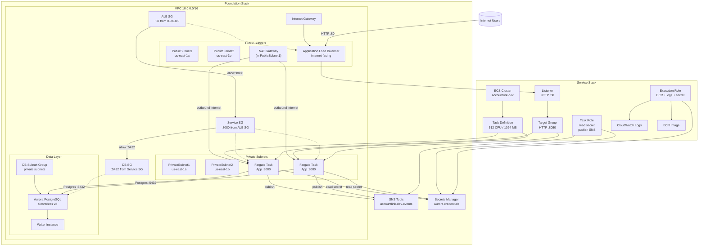

# CDK Infrastructure

AWS CDK app for provisioning `accountlink-platform-go` infrastructure.

## Scope
This README covers only the CDK project in `infra/cdk`.

## Deployment Diagram



## What this CDK app creates
- Foundation stack (`<app>-<env>-foundation`)
  - VPC (new or imported)
  - Aurora PostgreSQL Serverless v2 cluster
  - Security groups for DB access
  - SNS topic for account link events
- Service stack (`<app>-<env>-service`)
  - ECS Fargate service
  - Application Load Balancer (HTTP)
  - ECR asset build/push from the repository `Dockerfile`
  - Runtime wiring to Aurora via generated secret/endpoint values
  - SNS publish permission and topic ARN injection for app event publishing

## Project layout
- `bin/app.ts`: entrypoint and context/env resolution
- `lib/foundation-stack.ts`: network + database
- `lib/service-stack.ts`: ECS/ALB + app deployment
- `lib/config/`: per-environment defaults (`dev`, `test`, `prod`)

## Prerequisites
- AWS credentials for the target account/region
- Node.js + npm
- Docker (required for image asset build during synth/deploy)
- `just` (optional, but preferred for consistent commands)

## Install dependencies
```bash
just infra-install
```

## Run infra tests
```bash
just test-infra
```

## Environment configuration
Defaults are defined in:
- `lib/config/dev.ts`
- `lib/config/test.ts`
- `lib/config/prod.ts`

Required per environment:
- `account`
- `region`

Common configurable values:
- `appName`
- `desiredCount`
- `containerPort`
- `vpcId` (optional import of an existing VPC)

## Context and environment overrides
`bin/app.ts` resolves values in this order:
1. CDK context (`-c key=value`)
2. Environment variables
3. `lib/config/<env>.ts` defaults

Supported keys:
- `envName` / `ENV_NAME`
- `appName` / `APP_NAME`
- `account` / `AWS_ACCOUNT_ID`
- `region` / `AWS_REGION`
- `vpcId` / `VPC_ID`
- `containerPort` / `CONTAINER_PORT`
- `desiredCount` / `DESIRED_COUNT`
- `imageAssetPath` / `IMAGE_ASSET_PATH`
- `imageAssetDockerfile` / `IMAGE_ASSET_DOCKERFILE`

## Bootstrap, synth, diff, deploy
From repo root:
```bash
just cdk-bootstrap dev
just cdk-synth dev
just cdk-deploy dev
```

## Deploy in stages
```bash
just cdk-deploy-foundation dev
just cdk-deploy-service dev
```

Optional app name override:
```bash
just cdk-deploy-foundation env=dev app_name=accountlink
just cdk-deploy-service env=dev app_name=accountlink
```

## Related workflow outside this directory
Database migrations are managed with Flyway in `infra/flyway` and are intentionally documented separately.
